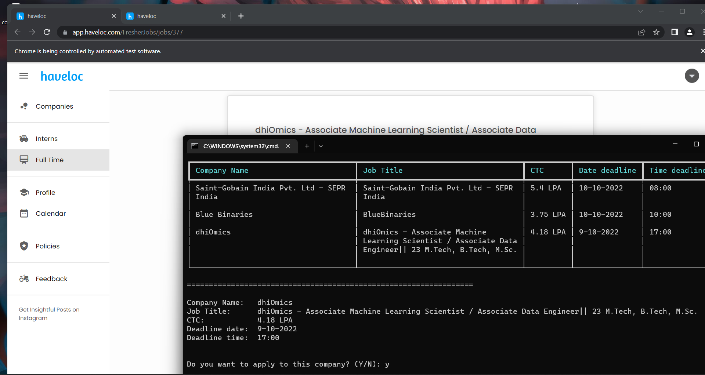

# Haveloc Helper

It's a simple python code inspired by the trash UI/UX of a job application platform haveloc. 
Uses selenium web driver and automates a lot of tedious work and makes your job applications part easy.

Current features:
  - Export all company data as csv file
  - Direct to job application pages



How to use it:
- Check if you have python. To check it, open cmd and do the following:
  - Run `python --version`
  - If that doesn't work, check for `py --version`
  - For either of those, if you get something like `Python 3.x.x` (x can be any number), you have python installed and you can continue with the setup. Otherwise get [python](https://www.python.org/ftp/python/3.10.4/python-3.10.4.exe).
- Run the following command
```
  curl -o installer.py https://raw.githubusercontent.com/insaiyancvk/haveloc-helper/main/installer.py && python installer.py
```

Plans:
  - Create a local json file that stores user's haveloc credentials ✅
  - Improve UI/UX ✅
  - Get the page size based on total current companies ✅
